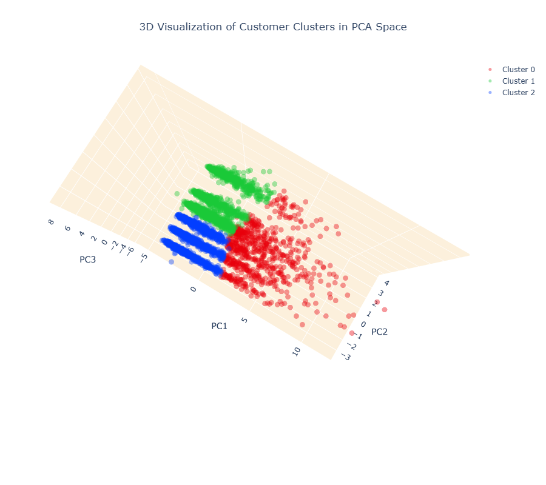
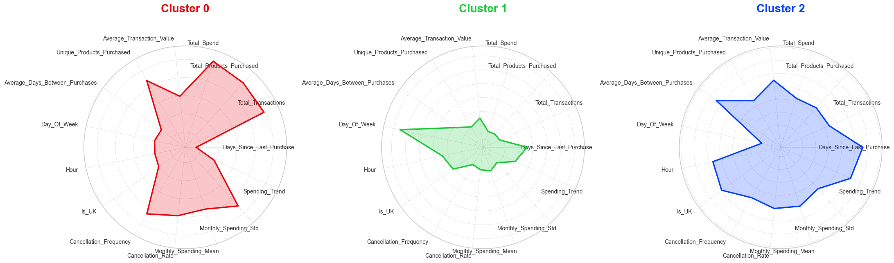

## **E-Commerce Customer Segmentation & Business Recommendations**

---

### **1. Project Overview**

This project focuses on analyzing a transactional dataset from a UK-based online retailer (spanning 2010-2011). The primary objective is to optimize marketing strategies and boost sales revenue through advanced Customer Segmentation.

I transformed raw transactional data into a customer-centric dataset, applied advanced Feature Engineering, and utilized K-Means Clustering combined with PCA (Principal Component Analysis) to identify distinct customer groups.

---

### **2. Key Objectives**

- **Data Cleaning**: Handle noise, missing values, and outliers to ensure data quality.
- **Feature Engineering**: Construct RFM metrics (Recency, Frequency, Monetary), behavioral features, and seasonality trends.
- **Dimensionality Reduction**: Implement PCA to reduce dimensionality and improve clustering performance.
- **Clustering**: Segment customers using K-Means and evaluate cluster quality via Silhouette Analysis and Elbow Method.
- **Business Insights**: Propose actionable, data-driven marketing strategies for each identified segment.

---

### **3. Tech Stack**

- **Language**: Python
- **Data Processing**: Pandas, NumPy
- **Visualization**: Matplotlib, Seaborn, Plotly (3D Interactive Charts)
- **Machine Learning**: Scikit-learn (K-Means, PCA, Isolation Forest), Yellowbrick
- **Environment**: Jupyter Notebook

---

### **4. Workflow**

The project follows a rigorous 12-step Data Science pipeline:

1. **Setup & Data Acquisition**: Load dataset from the UCI Machine Learning Repository.
2. **Exploratory Data Analysis (EDA)**: Preliminary structure assessment and descriptive statistics.
3. **Data Cleaning**: Handle missing CustomerIDs, remove cancelled transactions, and filter anomalous StockCodes.
4. **Feature Engineering (Critical Step)**:
    - RFM Metrics: Recency, Frequency, Monetary.
    - Behavioral: Average days between purchases, favorite shopping day/hour.
    - Geographic: UK vs. Non-UK classification.
    - Seasonality: Monthly spending trends and variability.
5. **Outlier Detection**: Utilize Isolation Forest algorithm.
6. **Correlation Analysis**: Assess Multicollinearity among features.
7. **Feature Scaling**: Standardize data using StandardScaler.
8. **Dimensionality Reduction (PCA)**: Retain 6 principal components (explaining ~81% of variance).
9. **K-Means Clustering**: Determine optimal K using Elbow Method and Silhouette Score (Selected K=3).
10. **Model Evaluation**: Analyze clusters using 3D Visualization and Radar Charts.
11. **Customer Profiling**: Build detailed profiles for each segment.
12. **Business Recommendations**: Derive actionable insights and marketing strategies.

---

### **5. Key Findings**

The model identified 3 distinct customer clusters:

| Cluster | Profile Name | Key Characteristics | Recommended Strategy |
|---------|-------------|---------------------|---------------------|
| 0 | Frequent High-Spenders (Risk of Churn) | High total spend and diverse purchases, but high cancellation rate and declining spending trend. | Implement VIP programs and personalized follow-ups to reduce churn. |
| 1 | Sporadic Weekend Shoppers | Low frequency, shops mainly on weekends, smaller basket sizes. | Launch weekend-exclusive promotions and bundle offers to increase cart value. |
| 2 | Infrequent Big Spenders (Trending Up) | Low frequency but high value per order, increasing spending trend, prefers evening shopping. | Offer premium memberships and schedule evening notifications (6-9 PM). |

**3D Cluster Visualization**

    

**Radar Chart of Cluster Profiles**

    

---

### **6. Author**

**Le Dang Gia Khanh**

Data Science Student | AI Enthusiast

Focus: Data Analysis, Machine Learning, Business Intelligence

[LinkedIn](http://linkedin.com/in/ledanggiakhanh) | [Email](mailto:ldgk2712@gmail.com)

*This project is part of my research journey in applying AI to solve real-world business problems.*

